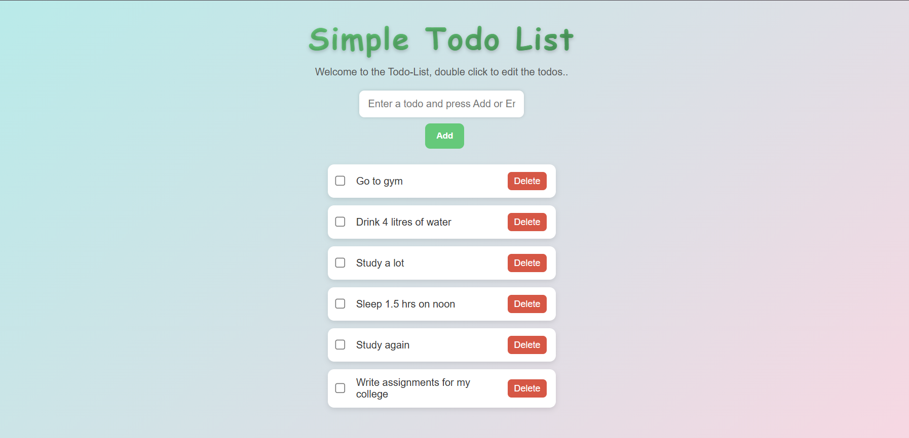

# 📝 Simple Todo App  

A clean, minimal, and interactive **Todo List** built using **HTML**, **CSS**, and **JavaScript**.  
This app helps you manage your daily tasks efficiently — add, edit, mark as complete, or delete todos easily!  

---

## ✨ Features  
✅ Add new todos  
✅ Delete existing todos  
✅ Edit todos by double-clicking  
✅ Mark tasks as completed (with strike-through effect)  
✅ Automatically saves todos using **Local Storage**  
✅ Smooth animations and a modern UI  

---

## 🖥️ Live Demo  
🔗 [Click Here to View Live](https://shuvradip-chakraborty.github.io/SIMPLE-TODO-APP/)  

---

## 📂 Project Structure  

```text
simple-todo-app/
├── index.html      # Main HTML file
├── style.css       # App styling and layout
└── script.js       # Logic and localStorage handling
```


---

## 🚀 How to Run Locally  
1. Clone this repository:  
git clone https://github.com/Shuvradip-Chakraborty/SIMPLE-TODO-APP.git

2. Open the folder:  
cd simple-todo-app

3. Run the project by simply opening `index.html` in your browser.  

---

## 💡 Technologies Used  
- **HTML5** – structure of the page  
- **CSS3** – modern UI design with animations  
- **JavaScript (ES6)** – handles logic and data storage  

---

## 🖼️ Preview




---

## 👨‍💻 Author  
**Shuvradip Chakraborty**  

---

## ⭐ Support  
If you like this project, don’t forget to **star ⭐ the repository** — it helps others discover it too!  

